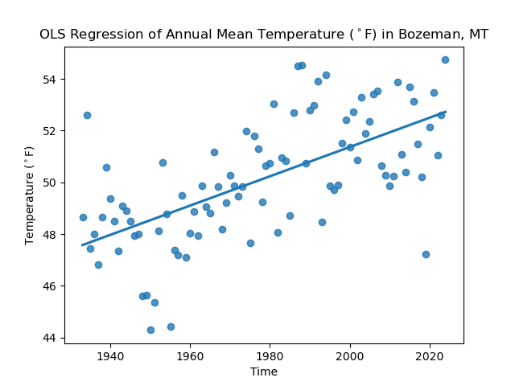

# Climate Change in Bozeman, Montana

 - picture of Bozeman, the Bridgers, etc

For this project, I investigated annual mean temperature in Bozeman, Montana within the last century. I live in Bozeman - it's a beautiful town characterized by long, cold, snowy winters and short, cool summers. Personally, I think it's a fanastic climate, as do many residents in town. However, long-time residents often wax poetic on how great the summers used to be and how much hotter & smokier they are now, 
as well as how much colder and snowier the winters used to be. These claims are worth paying attention to, so I performed an **Ordinary Least Squares (OLS) Linear Regression** to begin investigating how climate change is impacting Bozeman.

Displayed below are annual average temperatures in Bozeman, Montana. These data were collected by a weather station installed at Montana State University (MSU). I downloaded them from the Global Historical Climate Network - Daily (GHCND) dataset maintained by the National Center for Environmental Information, using their [Climate Data Online portal](https://www.ncei.noaa.gov/cdo-web/search?datasetid=GHCND). The station I accessed uses the Station ID: USC00241044. The dataset starts in 1892 and is still growing. However, after preliminary analysis, I found that the dataset has a significant of information missing in its early years; until 1933, each year has at least one month (Days 1-31) of missing values. These gaps often occured from November 1 to March 31, though other months were missing in the 1892-1933 period as well. My hypothesis is that, given MSU's origin as a land grant agricultural university, the weatherstation operator did not collect data during the winter months; perhaps they were not concerned with temperatures while the ground was snow covered.

Given the gaps in the dataset, I decided to exlude all years before 1933, so the years I've analyzed are 1933-2024.

<embed type="text/html" src="projects/02-climate-change/bzn_t_ann_plot_int.html">

You can mouse over any point on the graph to view the annual mean temperature from any given year.

Just from a glance at the plot, it looks like there's a warming trend. So, I performed an **OLS Linear Regression** to see if annual mean temperature in Bozeman is, in fact, warming, and if so, by how much:

The regression clears shows a warming trend in Bozeman, MT between 1933-2024. Indeed, annual mean Bozeman has warmed by .056&deg;F per year in this period. 
That's over half a degree each decade, and over 5&deg;F in the time period (91).
This finding is in line with other analyses - for example, Climate Central, an organization dedicated to sharing the effects of climate change with the public, 
[shows that Bozeman has warmed by 2.2&deg;F since 1970](https://www.climatecentral.org/climate-local/41399), which is about halfway through my dataset.

To access the dataset I used or reproduce my analysis, please check out the [Jupyter Notebook](projects/02-climate-change/Climate-Coding-Challenge_Bozeman.ipynb) I used.

