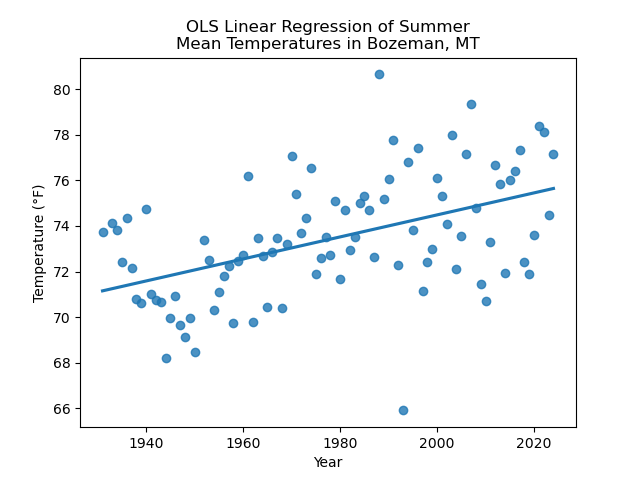
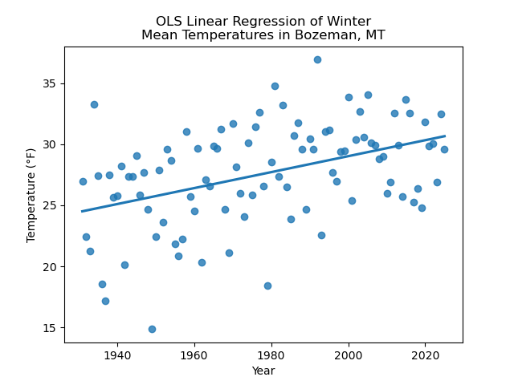
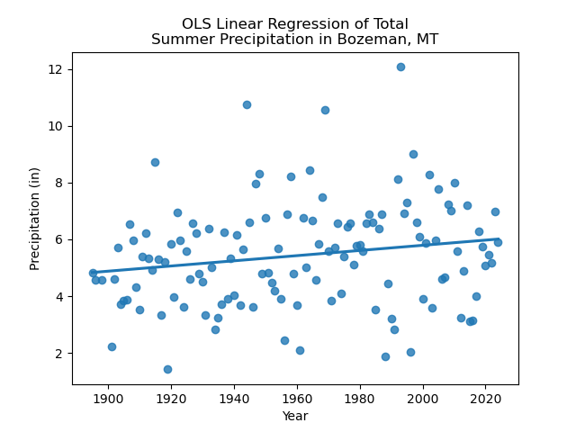
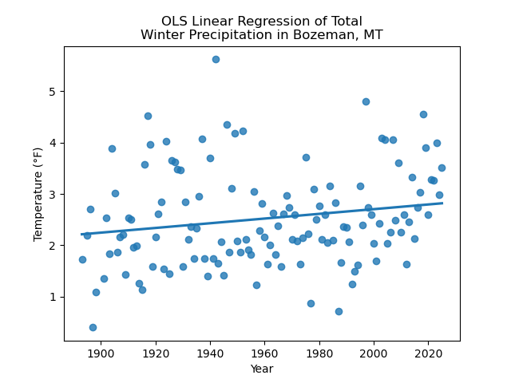

# A Deeper Investigation into Climate Change in Bozeman, Montana

The western side of the Bridger Range, north of Bozeman, MT.

## Background
Climate change is affecting temperature and precipitation trends across the country. However, studies have shown that these changes are not uniform across seasons, and some seasons are changing at different rates. Winter and summer are warming at different rates ([Asif et al. 2023](https://doi.org/10.1007/s11269-023-03474-4); [ClimateCentral.org](https://www.climatecentral.org/climate-matters/fastest-warming-seasons-2025); [EPA.gov](https://www.epa.gov/climate-indicators/seasonality-and-climate-change)). In a previous project for this class, I investigated how annual mean temperature has changed in my home in Bozeman, MT over the past 91 years. I found that annual mean temperature in Bozeman has risen at a rate of 0.05&deg;F per year in that span, which equates to over 5&deg;F in 91 years. I was interested in exploring this finding further; in particular, I was curious if temperatures and precipitation in Bozeman are changing consistently across the year, or if there are different rates of change at sub-annual levels.

## Methods
To answer my questions, I downloaded temperature and precipitation records from the Global Historical Climate Network - Daily (GHCNd) dataset maintained by the National Center for Environmental Information, using their [Climate Data Online portal](https://www.ncei.noaa.gov/cdo-web/search?datasetid=GHCND) API. The station I accessed uses the Station ID: USC00241044. These data were collected by a weather station installed at Montana State University (MSU). The dataset starts in 1892 and is still growing. In my first analysis, I found that the dataset has a significant amount of information missing in its early years. For example, in the temperature record, each year has at least one month (Days 1-31) of missing values until 1933. These gaps often occurred from November 1 to March 31, though other months were missing in the 1892-1933 period as well. Given MSU's origin as a land grant agricultural university, I hypothesize that the weatherstation operator did not collect data during the winter months. To account for these gaps in the records, I had to ensure I excluded years that had at least one missing month. To do this, I counted the number of NaN values in each year, and then used that count to exclude years that had at least 28 NaN values (the smallest number of days in a month).

For this analysis, I looked at the difference in rates of change between summer and winter seasons. Summer is defined as the months of June, July, and August (JJA), and winter is defined as December, January, and February (DJF). Once I had cleaned the datasets of years with missing values, I separated each record into the summer and winter timeseries. Because temperature is continuous across time, I averaged the seasons to an annual scale. However, because precipitation is not continuous and many days have no precipitation, I totalled each season's precipitation on an annual basis. I then plotted the series, and performed the same Ordinary Least Squares (OLS) Linear Regression to determine how much summer and winter temperature and precipitation are changing. 

## Results
<embed type="text/html" src="./projects/final_project/seas_means.html" width="500" height="500">
This plot shows annual mean temperature for summer and winter seasons. In the plot, we can see that there's potentially a warming trend across the record, but there's nothing definitive.

Linear regression analysis of summer temperature shows a clear warming trend. The slope of the regression line is 0.048&deg;F per year.

Linear regression analysis of winter temperature shows a clear warming trend as well. The slope of the regression line is 0.065&deg;F per year.

<embed type="text/html" src="./projects/final_project/seas_precip_means.html" width="500" height="500">
This plot shows annual total precipitation from summer and winter seasons. It's not clear that there is an increasing or decreasing trend in the record.

Linear regression analysis of summer precipitation shows an increasing trend. The slope of the regression line is 0.009 inches per year.

Linear regression analysis of summer temperature shows an increasing trend. The slope of the regression line is 0.005 inches per year.

## Discussion
Analysis of seasonal mean temperature shows a clear warming trend across both seasons, but a difference in the rate of change between summer and winter. Winter has warmed by 5.915&deg;F in 91 years, while summer has warmed by 4.368&deg;F in 91 years. As suggested by the literature (Asif et al. 2023), winter is indeed warming faster. The difference is impressive, as winter is warming about 26% faster than summer. Analysis of seasonal total precipitation trends also shows an increasing trend across the dataset. Summer precipitation is increasing about 44% faster than winter. However, the total change across the dataset may not be dramatic; summer precipitation has increased by 0.82 inches in 91 years, and winter precipitation has increased by 0.46 inches in 91 years. 

## Conclusions
In general, my findings agree with the projections suggested by the literature. Winter in Bozeman is warming faster than summer. This finding suggests further work. I'm interested to know if precipitation type is changing due to this increasing temperature, as that would have major implications for the region. In addition, it would be interesting to explore if the rates of change in seasonal mean temperatures are linear, or if they are accelerating. Precipitation findings are less clear than the temperature findings. Summer precipitation is increasing more than winter, but the total increases don't seem huge. My findings disagree with those of [Harp and Horton 2023](https://doi.org/10.1029/2023GL104533), who found that precipitation across the Northern Rocky Mountains has decreased across the period of record. I would be curious to understand the range of inter-annual variability in seasonal precipitation, and how that compares to rates of change in total winter and summer precipitation. Further analysis is necessary to understand if these rates are statistically significant or just noise. Finally, the GHCNd precipitation data product isn't perfectly documented - it's not clear to me how the winter data indicates quantity with frozen precipitation.

It is obvious that further work is required to quantify how the seasons in Bozeman are changing as the world warms, exactly. However, my temperature findings indicate potentially significant changes to the ecosystems surrounding Bozeman, with major implications for our tourism and agricultural industries.

## Sources

To see the Jupyter notebooks I used to perform this analysis, please check out the following links:

-[Temperature Notebook](./projects/final_project/05-bozeman-final-temperature.html)

-[Precipitation Notebook](./projects/final_project/05-bozeman-final-precipitation.html)

 Access the GHCNd database [here.](https://www.ncei.noaa.gov/cdo-web/)
