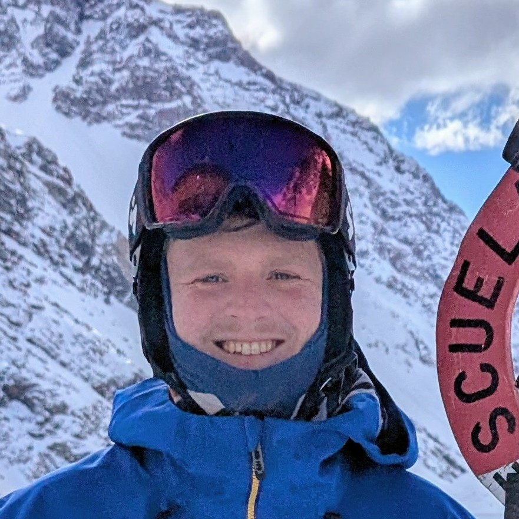

## About Me
Hello! I am from Santa Fe, New Mexico. I went to Hampshire College, which is a pretty small school in western Massachusetts, down the road from UMass Amherst and Amherst College. I studied Climate Science, Philosophy, and Environmental Policy at Hampshire, and completed a thesis that explored a novel way to present climate model data so they are more relevant to general stakeholders. I taught myself how to use Matlab during my thesis. I'm planning on applying to graduate school this fall, probably in Geography or Atmospheric Science (potentially at CU!). My interests lie in connecting stakeholders with climate model outputs in order to facilitate adaptation and mitigation efforts. If you have thoughts, questions, recommendations, etc. - I'm all ears!

Since graduating college, I've been skiing... a lot. I work as a ski instructor at Big Sky, MT and Portillo, Chile. I hold Alpine Level III and Children's Specialist II certifications from the Professional Ski Instructors of America. I love skiing at the resort and in the backcountry, and I love getting to talk about it with fellow ski nerds. When not skiing, you'll probably find me mountain biking or trail running.

## Things I'm Excited About
- Learning more widely used programming languages and systematic coding habits
- Utilizing the growing pool of Earth Science data and techniques with global and regional climate model outputs to improve accuracy in mountainous regions and aid adaptation efforts.
- Fighting and mitigating the impacts of climate change in the Rocky Mountains (and everywhere)

 You might notice these goals have slightly different scopes. You're right. 

## Contact 
- raini.helmstadter@colorado.edu
