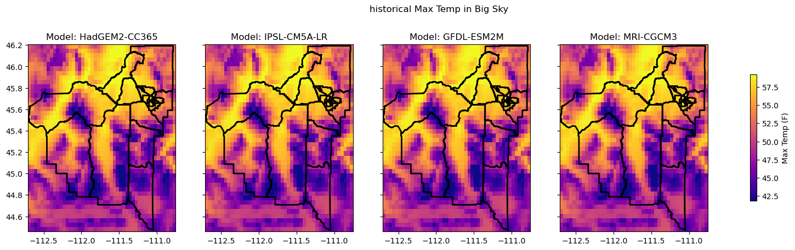
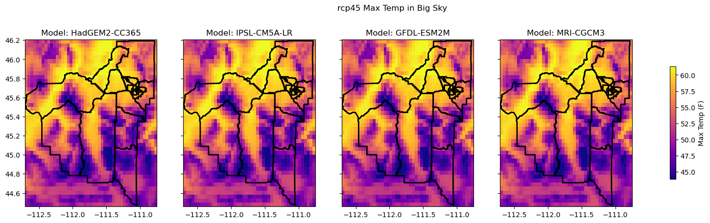
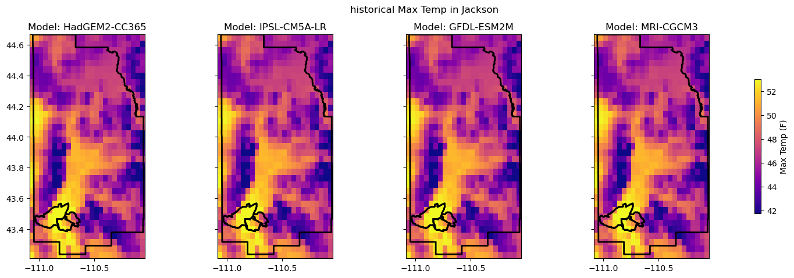
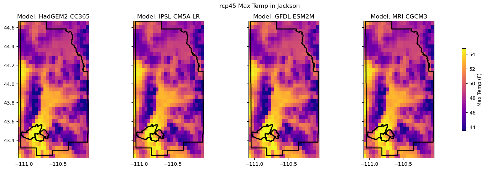
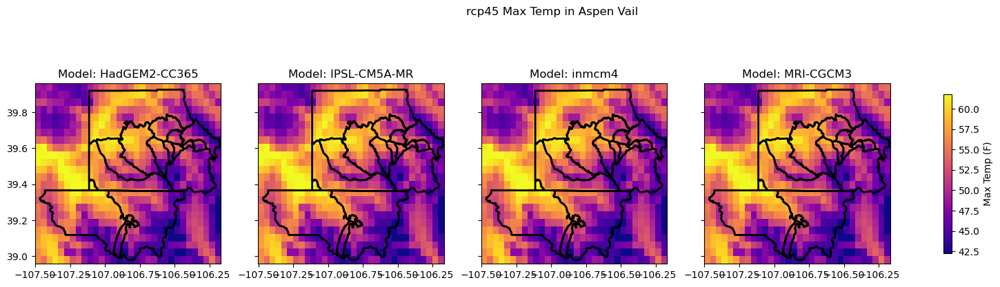
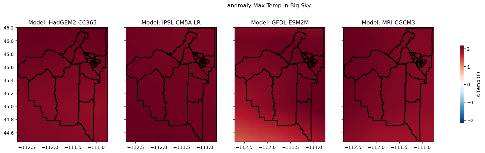

# Heatwaves in Ski Towns

## Introduction
As a ski instructor, I've just witnessed one of the strangest winters I can remember. We had low snow, dry spells, rain in  the depths of winter, and most concerning, long periods of elevated heat. There were weeks in February and March with days well into the 40&deg;Fs and without an overnight freeze - at 7000ft or higher in Montana. These patterns were unlike any winter I've seen, and the impact were concerning, to say the least. My colleagues and I had clients cancel trips, and many instructors struggled to find enough work. The question everyone was wondering - "Is this an outlier winter, or is this a sign of a new normal?"

Mountain towns, such as Big Sky, where I work, are particularly vulnerable to the impacts of climate change. These communities are almost entirely dependent on outdoor recreation for their economic viability. Without snowy winters and beautiful summers, places like Big Sky, Aspen, or Jackson Hole would have no source of income. Of course, mountainous regions are warming faster than average [(Pepin et al. 2025)](https://www.nature.com/articles/s43017-025-00740-4), exacerbating the risk to mountain town's economic lifelines. Mountain towns like Aspen or Jackson are often thought of as extremely wealthy. However, they are actually home to some of the greatest income inequalities in the United States. While some residents are extremely affluent, many are not. Coupled with high costs of living due to rural locations and property values, the economic reality for many residents of mountain towns (who often work in crucial positions) may actually be quite precarious.

Inspired by the dismal winter of 2025-2026 across the Rockies, we focused our final project on the tension between the economic and climatic outlooks of mountain. Using climate model projections and social vulnerability data, we hope to quantify how future climate change will impact the socioeconomic status of residents in three study locations in the Rocky Mountain region (Big Sky, MT; Jackson Hole, WY; and Aspen/Vail, CO).

Expected outcomes of the project will help inform future adaptation efforts. First, we will determine which socioeconomic variables are most indicative of vulnerability to climate change in mountain towns. We will also quantify the frequency and severity of heat waves in mountain towns, both in winter and summer. From this finding, we will be able to make inferences on future snowpack and wildfire risks. 

## Methods

My collaborator Alison Gregory took on the socioeconomic dimension of this project. Here, I will detail the methodology of the climate dimension of the project.

### Model Selection
The study areas selected for this area are geographically small, often less than 1&deg; of latitude and longitude in size. However, they are topographically quite complex, which presents a key challenge in examining future climate projections. Global climate models (GCMs) typically have grid resolutions at least 1&deg; of latitude in size; as such, we turned to downscaled model products. Models can either be downscaled dynamically, where a regional model is used, nested within GCM results, or statistically, where a statistical model is established for each grid cell using station records and reanalysis data. In general, climate impact studies have typically used statistically downscaled products [(Kim et al. 2022)](https://doi.org/10.1088/2515-7620/aca3ee); we followed this trend.

Within the statistical downscaling realm, there are a variety of datasets available. However, as Kim et al. 2022 highlights, each dataset uses different downscaling methodology and different training datasets; training data can be the greatest source of variability between the datasets. Thus, careful selection of which dataset to use is critical. 

In preliminary research, we considered three potential datasets: MACAv2-METDATA (MACA), LOCA, and NASA NEX DCP30. MACA and LOCA both use CMIP5 emissions pathways, which are, at this point, slightly outdated, while NEX DCP30 uses CMIP6 pathways. In addition, NEX DCP30 offers incredibly high resolution at 30 arcseconds, or roughly 800 meters [(Thrasher et al. 2024)](https://www.nature.com/articles/s41597-024-04188-x). These two factors were appealing; unfortunately, NEX DCP30 only offers monthly resolution, eliminating it from our consideration. Based on the findings of two studies - Kim et al. 2022 and Wang et al. 2020 - we decided to utilize the MACA dataset. [Wang et al. 2020](https://journals.ametsoc.org/view/journals/hydr/21/12/jhm-d-19-0275.1.xml) found that LOCA and MACA are generally similar in predicting future climate, but MACA had greater magnitude of extreme events than LOCA due to its methodology. This is obviously appealing for studying extreme events. Kim et al. 2022 noted that LOCA was a fairly consistent outlier in the western US across a variety of metrics, suggesting further study before selecting that dataset. In addition, Kim et al. 2022 noted the importance of minimum temperature (Tmin) in heat wave studies; the MACA dataset was consistently a middle of the road ensemble, suggesting a good fit for preliminary work. Given all the strengths highlighted above, we selected [MACAv2-METDATA](https://www.climatologylab.org/maca.html) [(Abatzoglou and Brown, 2012)](https://rmets.onlinelibrary.wiley.com/doi/abs/10.1002/joc.2312) as the ensemble to begin with. Future work could involve other datasets; for example, Kim et al. 2022 noted the ClimateNA dataset's relative skill in snowpack studies.

### Time Period and Emissions Scope
We chose to investigate climate projections for the mid-century (2035-2065) and under the RCP4.5 emissions pathway. Both of these choices were made with the intent to increase relevance for stakeholder planning in adaptation efforts. The mid-century time period is not actually that far in the distance - it begins in just 9 years - which should make it more tangible. In addition, it is more relevant for planning efforts, as adaptation projects would likely not look as far out as 2100. Further, the world seems to be tracking the RCP4.5 scenario closest, so these projections should be the closest approximation of realized future change.

### Heat Indices
Given our focus on heat waves in summer and winter, we will be first comparing average Maximum Air Temperature in the summer months (June, July, August) and the average Maximum Air Temperature in the winter months (December, January, February). We will drawn upon studies such as [Yu et al. 2025](https://www.sciencedirect.com/science/article/pii/S0048969725011386) to refine heat wave calculation methods.

## Results and Discussion

######  Big Sky Results

######  Jackson Hole Results

######  Aspen/Vail Results

Preliminary exploration of the MACA data shows promise for studying climate impacts across the counties we are focused on. There is satisfactory resolution, as geographic variation can clearly be seen in each study area, which are typically about the size of a single GCM cell. In addition, as seen in the plots above, a clear warming trend can be observed, with roughly 2&deg;F of warming occurring in the Big Sky and Aspen/Vail regions, while the Jackson region has about 1.5&deg;F of warming by mid-century. These plots are of annual mean maximum temperature, which is a very coarse view. 

######  Big Sky Anomaly Results

Plotting of anomaly calculations reveals a quirk of the downscaled product. While the plot shows a temperature anomaly, it is almost entirely uniform across the study area. Given that the GCM's grid cell was about 1&deg of latitude/longitude before downscaling, it is likely that our study area may be within one cell. Thus, anomaly calculation removes the downscaling modification, and just shows the underlying GCM warming. Further investigation is necessary, of course.

## Conclusions and Future Plans
Background review and preliminary research has been conducted for this study. We have the climate projections we need, at a resolution that will be effective. Next steps will utilize daily data to measure heat wave severity and frequency. We plan to investigate heat waves during winter and summer seasons, as both may have significant impacts on our study areas. We also plan to develop adaptability metrics using the both socioeconomic and climate data. After heat wave research, we also would like to investigate other variables such as precipitation or humidity to better quantify extreme event impacts. We are particularly interested in snowpack and wildfire projections as well. Finally, consideration of different downscaled datasets may further inform impact assessments and adaptation work; we hope to explore these in further datasets.

## Resources
Our project repository can be found [here.](https://github.com/algrego/mtn-heat-waves)

- Abatzoglou, J. T., & Brown, T. J. (2012). A comparison of statistical downscaling methods suited for wildfire applications. International Journal of Climatology, 32(5), 772–780. [https://doi.org/10.1002/joc.2312]
- Kim, J. B., Jiang, Y., Hawkins, L. R., & Still, C. J. (2022). A comparison of multiple statistically downscaled climate change datasets for the conterminous USA. Environmental Research Communications, 4(12), 125005. [https://doi.org/10.1088/2515-7620/aca3ee]
- Pepin, N., Apple, M., Knowles, J., Terzago, S., Arnone, E., Hänchen, L., Napoli, A., Potter, E., Steiner, J., Williamson, S. N., Ahrens, B., Dhar, T., Dimri, A. P., Palazzi, E., Rameshan, A., Salzmann, N., Shahgedanova, M., Vidal Jr, J. de D., & Zardi, D. (2025). Elevation-dependent climate change in mountain environments. Nature Reviews Earth & Environment, 6(12), 772–788. [https://doi.org/10.1038/s43017-025-00740-4]
- Thrasher, B., Khajehei, S., Kim, J. B., & Brosnan, I. (2024). NASA Earth Exchange Downscaled Climate Projections 30 Arcseconds CMIP6. Scientific Data, 11(1), 1346. [https://doi.org/10.1038/s41597-024-04188-x]
- Wang, G., Kirchhoff, C. J., Seth, A., Abatzoglou, J. T., Livneh, B., Pierce, D. W., Fomenko, L., & Ding, T. (2020). Projected Changes of Precipitation Characteristics Depend on Downscaling Method and Training Data: MACA versus LOCA Using the U.S. Northeast as an Example. Journal of Hydrometeorology, 21(12), 2739–2758. [https://doi.org/10.1175/JHM-D-19-0275.1]
- Yu, J., Moise, A. F., Sahany, S., Prasanna, V., Chua, X. R., Chen, C., Hassim, M. E. E., Lim, G., Luo, F., Kumar, A., Liu, P., & Raavi, P. H. (2025). High-resolution dynamically downscaled projections of future extreme temperatures, heatwaves and exposure in Southeast Asia. Science of The Total Environment, 980, 179501. [https://doi.org/10.1016/j.scitotenv.2025.179501]
