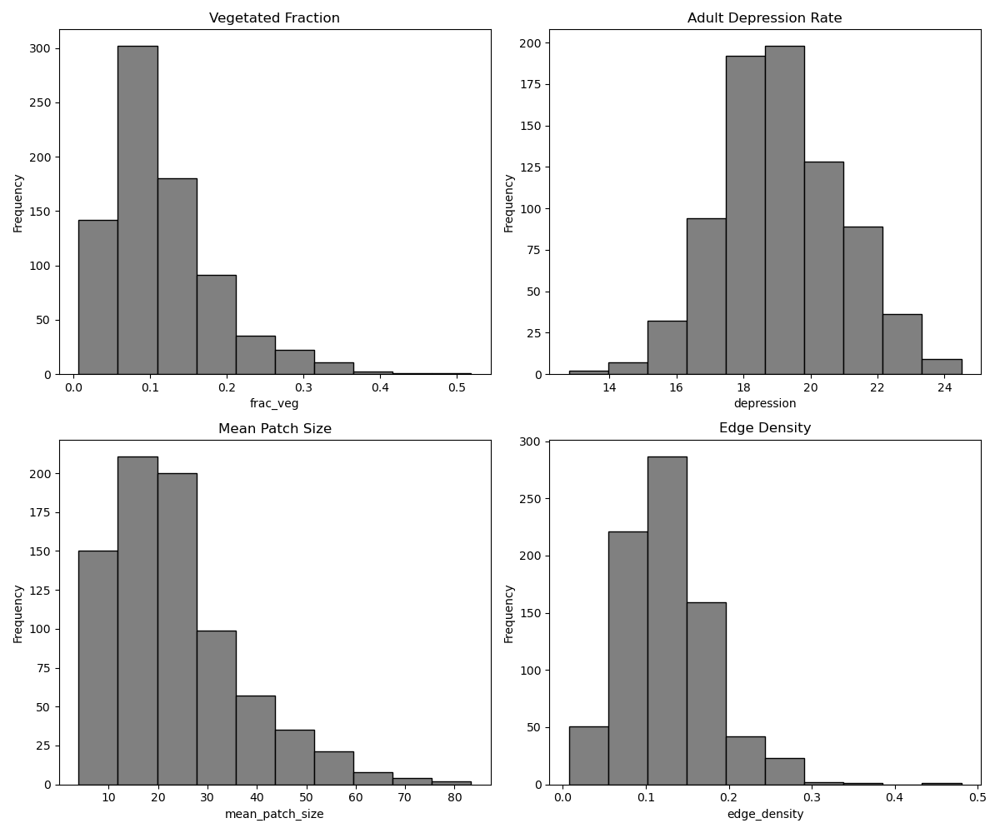
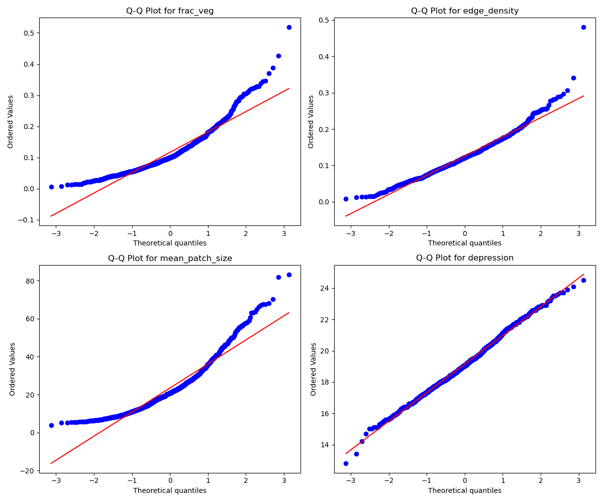
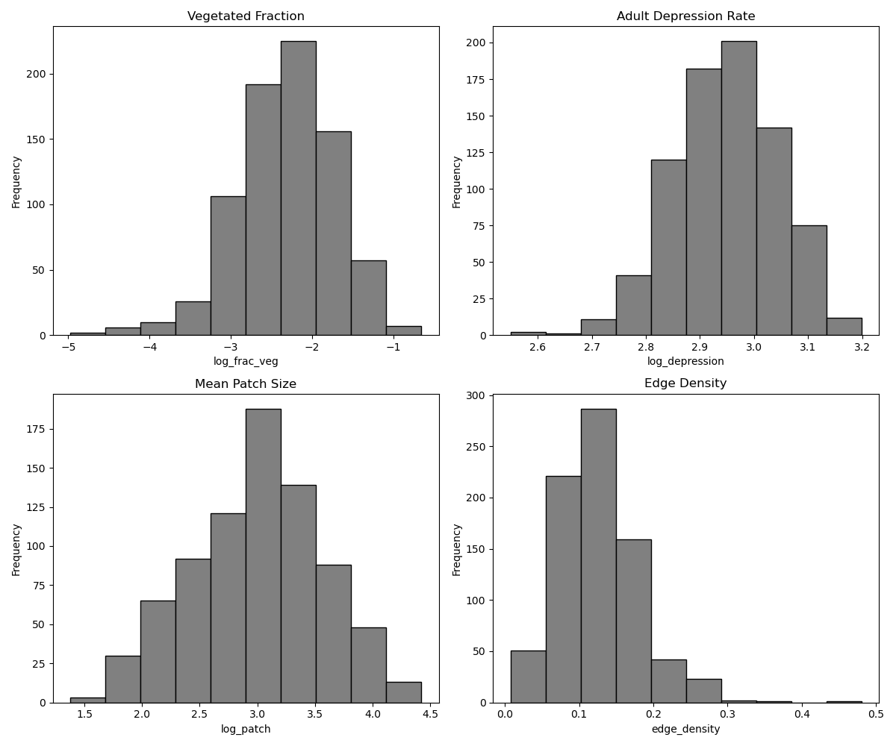
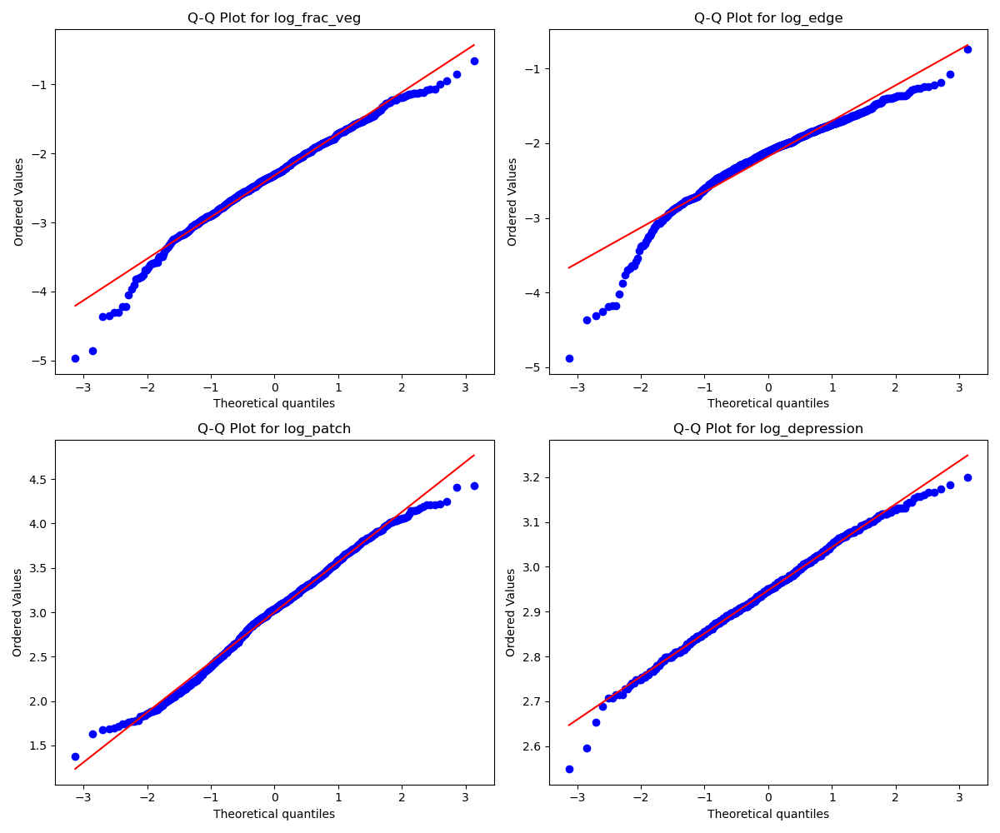

# Urban Greenspace and Depression Prevalence in Chicago, IL

## Introduction
For this project, I investigated the relationship between urban greenspace and depression prevalence in Chicago, IL. Urban greenspaces are widely known to have a variety of impacts on public health outcomes, from _____ to _______ to ________ (add sources here). In a previous project, I have investigated how greenspace influenced asthma rates in Chicago. For this project, I was interested in investigating how greenspaces influence mental health outcomes, rather than physical health outcomes. Specifically, I investigated depression rates. Common treatment recommendations for depression can include regular exercise and interaction with nature; access to greenspace could obviously impact these treatments. Previous studies have investigated this topic. ____ found ______; ______ found _______.

Greenspaces are often unfairly distributed across cities due to histories of redlining and inadequate funding. Typically, neighborhoods with less greenspace are home to marginalized communities.

<embed type="text/html" src="./projects/urban_greenspace/chicago_depression_chloropleth.html" width="600" height="600">
This chloropleth plot shows depression rates per census tract in Chicago. 

## Methods
To investigate this question, I utilized data from the [CDC Places](https://www.cdc.gov/places/tools/data-portal.html) dataset and [NAIP imagery](https://www.usgs.gov/centers/eros/science/usgs-eros-archive-aerial-photography-national-agriculture-imagery-program-naip) accessed through the [Microsoft Planetary Computer](https://planetarycomputer.microsoft.com/) (MPC). The CDC Places dataset _______. NAIP imagery ___________. I accessed the MPC using the STAC API. I used the NAIP imagery to calculate NDVI statistics on greenspace for each census tract. 

First, I downloaded census tracts from the CDC, and then utilized the Socrata API to download data on depression rates for each census tract in 2023. Next, I gathered the MPC URL(s) for the NAIP imagery that corresponds to each census tract. This list of URLs was then be used to compute the NDVI statistics on the MPC. The statistics were: fraction vegetated, or fraction of the census tract that has vegetated (green) landcover; edge density, or how divided up or cohesive the greenspace in a tract is; and mean patch size, which is the average size of a greenspace in the given tract. To identify edges for the edge density, I performed a convolution using a 3x3 kernel. After computing NDVI statistics, I made chloropleth plots to visually compare depression rates and the various greenspace statistics. Finally, I used a linear regression model to better understand how strong the relationship between greenspace and depression rates is. I used a train-test-split method to test the data, as well as investigate spatial bias. Before performing the regression, I log transformed some variables to ensure issues of collinearity and normal distribution didn't interfere.

## Results

The chloropleth plot of depression rates per census tract across Chicago shows the greatest concentration (shown in the darker blue) in the northeast section of the city. There are other notable concentrations of high rates, generally in the southwest corner, though also in the central section. Rates are generally low in the central and southern sections of the city.

<embed type="text/html" src="./projects/urban_greenspace/depression_edge_chloropleth.html" width="600" height="400">
<embed type="text/html" src="./projects/urban_greenspace/depression_frac-veg_chloropleth.html" width="600" height="400">
<embed type="text/html" src="./projects/urban_greenspace/depression_mean-patch_chloropleth.html" width="600" height="400">
Visual comparisions of the depression rate per census tract and the vegetation statistics seem to show a positive relationship between greenspace and depression. Across all three variables, depression rates generally seem to be higher in places with higher greenspace values. However, this relationship does not hold throughout the city, as some tracts in the northwest and southwest corners have high greenspace values but do not have corresponding depression rates.

## Linear Regression
<embed type="text/html" src="./projects/urban_greenspace/depression_greenspace_scatterplot.html" width="600" height="600">
Scatterplots show varying colinearity among the variables. Fraction vegetated and edge density are most colinear, so we may want to leave one of those variables out. Mean patch size and fraction vegetated are also somewhat organized, but not to the degree of the previous set, so it should not pose an issue.

The histograms above show that the patch size variable has a long tail to the right and the depression variable is bimodal. The other two variables (fraction vegetated and edge density) appear to be more normally distributed. Due to this, a log transform of the the depression and patch size variables will be necessary to ensure the data are relatively normally distributed.

However, the q-q plots indicate that the depression might be normally distributed, and that mean patch size and fraction vegetated are not normally distibuted. To account for this issue, I performed a log transform on all of the variables and compared to decide which version to include in the analysis.

The histograms and q-q plots show that the log transform improved most variables. All except edge density are now more normally distributed. Based on this, I will use the untransformed edge density variable and log of mean patch size, fraction vegetated, and depression variables for the regression modeling.

<embed type="text/html" src="./projects/urban_greenspace/measured_vs_predicted.html" width="600" height="600">
The plot above shows that the greenspace statistics don't have a strong relationship to the prevalance of depression across the city. If the relationship were strong, the blue points would be plotted much closer to the line.

<embed type="text/html" src="./projects/urban_greenspace/error_chloropleth.html" width="600" height="600">
The chloropleth plot of error across Chicago reveals a distinct pattern. In general, the model underestimates the depression rate across the northern half, while generally overestimating the southern half, though there are clear pockets of underestimation in the southern portion of the city as well. The model error ranges by at least 10%, with greater magnitude in overestimation.

## Discussion

Based on the results, depression rates in Chicago are not strongly linked to urban greenspace in Chicago. Visual inpection of the chloropleth plots does not reveal a clear linkage pattern. This is reinforced by the linear regression modeling and error chloropleth plot, both of which do not show a clear, strong relationship between greenspace and depression rates. There may be a few reasons for this.

First, it's not clear that there is a mechanistic connection between greenspace and depression. As suggested by Yi et al. 2025, greenspace may help attenuate the symptoms of depression or other mental health disorders, but it isn't clearly able to solve depression. Thus, while greenspace may be helping residents manage, those diagnoses could still be in the CDC dataset. This differs from health counditions like asthma and heart disease, which may be directly impacted or alleviated by access to greenspace.

Second, 

## Conclusion

## Sources

## Notebook
