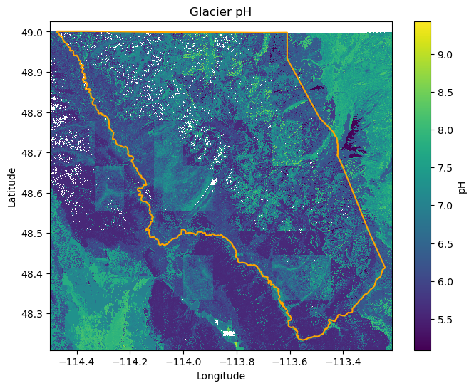
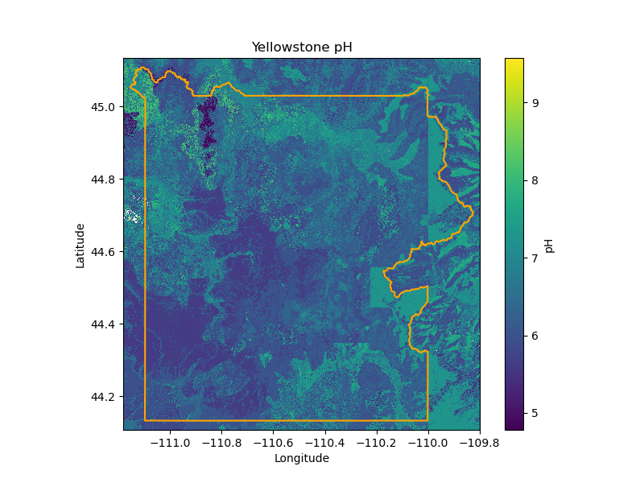
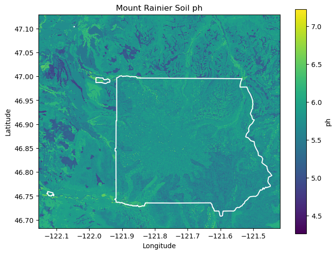
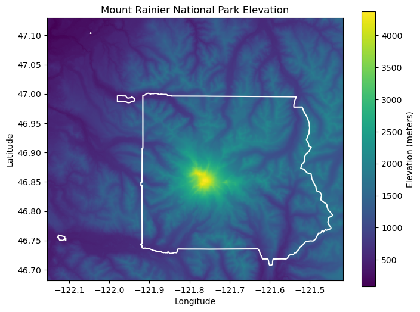
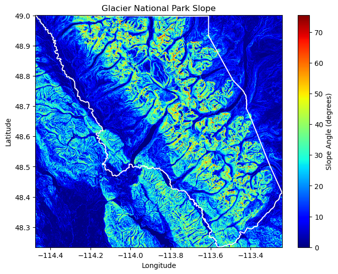
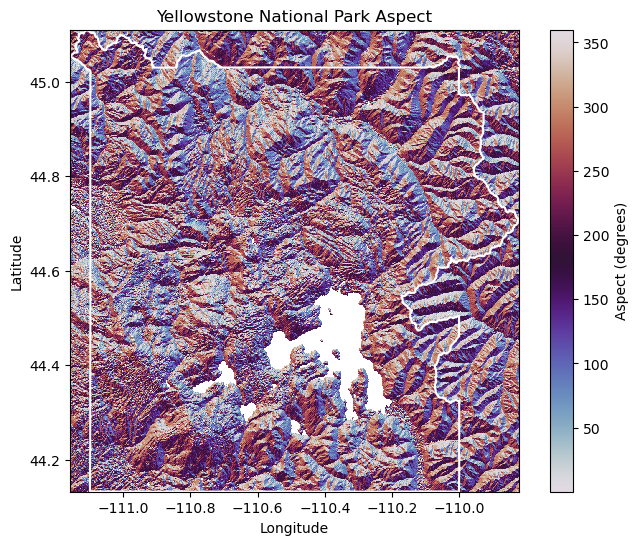

# Evolving Whitebark Pine Habitat Suitability

 By <a href="//commons.wikimedia.org/wiki/User:Wsiegmund" title="User:Wsiegmund">Walter Siegmund</a> <a href="//commons.wikimedia.org/wiki/User_talk:Wsiegmund" title="User talk:Wsiegmund">(talk)</a> - Own work, <a href="https://creativecommons.org/licenses/by/2.5" title="Creative Commons Attribution 2.5">CC BY 2.5</a>, <a href="https://commons.wikimedia.org/w/index.php?curid=340880">Link</a>

## Introduction

The Whitebark Pine is a charismatic, endangered tree found throughout the Northern Rocky and Cascade Mountains. The tree grows slowly and tends to grow in locations where other trees struggle to survive, such as drier, rockier locations higher on mountain ridges. Because it can survive harsher conditions than other trees, it is often a foundational species for subapline forests [https://whitebarkfound.org/about/why-does-whitebark-pine-matter/]()

Unfortunately, there are multiple major conservation risks to the Whitebark Pine, including Whitebark Blister Rust, pine beetles, and climate change. Blister Rust is an invasive fungus that kills trees over the course of 5-10 years, and has wiped out significant populations across the Rocky Mountains. Blister rust thrives in cooler, wetter climates, such as spring and fall. Pine beetles also pose a threat to the whitebark pine, as well as climate change. Both of these threats are bourne through rising temperatures; more beetles can survive milder winters, and higher temperatures decrease water availability and increase fire danger. [UDSA. Silvics of North America.](https://research.fs.usda.gov/silvics/whitebark-pine)

According to one study, Whitebark Pine is projected to potentially lose over 80% of its range by the mid-21st century due to changing climate, threats from Blister Rust, and Pine beetles [Parks et al. 2025](https://iopscience.iop.org/article/10.1088/1748-9326/adfcef). My study aims to expand on this work, utilizing various datasets to examine future habitat suitability across three National Parks: Glacier, Mount Rainier, and Yellowstone.

<embed type="text/html" src="./projects/habitat_suitability/yellowstone_site_map.html" height="500" width="800">
<embed type="text/html" src="./projects/habitat_suitability/glacier_site_map.html" height="500" width="800">
<embed type="text/html" src="./projects/habitat_suitability/rainier_site_map.html" height="500" width="800">

## Methods

To study future habitat suitability, I used a fuzzy logic model (FLM) with multiple inputs. The FLM incorporated soil pH parameters; elevation, slope, and aspect data; and multiple climate model datasets.

I initially planned on only studying Yellowstone and Glacier National Parks, as they are the two national parks in the state I live in, and are both home to Whitebark Pine. However, after comparing occurrence data from GBIF and national park boundaries, it became clear that more study sites were needed. While Glacier and Yellowstone do have Whitebark Pine, there were vastly more occurrences in the Cascade Range. I added Mount Rainier as a study site due to this finding.

Once sites were selected, I downloaded soil, elevation, and climate data:
- Soil pH data were downloaded from the [POLARIS dataset](https://pubs.usgs.gov/publication/70170912).
- Elevation data were downloaded from the [SRTM dataset](https://www.earthdata.nasa.gov/data/instruments/srtm).
- Climate model data were download from the [MACAv2 dataset](https://www.climatologylab.org/maca.html), which is a statistically downscaled ensemble.

Soil pH plots for each site:

Plots demonstrating elevation, aspect, and slope for sites:

The MACAv2 dataset contains a plethora of models; I studied a subset of them. This study used two time periods: a historic period (1970-1999) and a future period (2035-2050). Model data was averaged to a single moment in each period. I selected models using RCP8.5, which represents the 'worst-case' or 'business as usual' scenario, in which CO2 emissions continue to climb and little to no action is taken to reduce greenhouse gas emissions. Within the RCP8.5 ensemble, I selected four models per study site to capture the full range of possible outcomes. Models varied by study site, but were selected to capture the following outcomes (descriptors are relative):
- Cold and Dry
- Cold and Wet
- Hot and Dry
- Hot and Wet
Selections were made using the scatterplot tool on the [Northwest Knowledge site](https://climate.northwestknowledge.net/MACA/vis_scatterplot.php).

Below are the location parameters I used and the models I selected from the MACAv2 dataset:

Glacier: [-114.47496141,   48.23369274, -113.24188594,   49.00110346]
- CD - MRI-CGCM3
- CW - GFDL-ESM2M
- HW - HadGEM2-CC365
- HD - HadGEM2-ES365

Yellowstone: [-111.15593419,   44.13245333, -109.82419118,   45.10897528]
- CD - IPSL-CM5B-LR 
- CW - MRI-CGCM3
- HD - HadGEM2-ES365
- HW - MIROC-ESM-CHEM

Rainier: [-122.12954727,   46.70782285, -121.44288967,   47.10424002]
- CD - MRI-CGM3
- CW - GFDL-ESM2M
- HD - HadGEM2-CC365
- HW - CanESM2

After acquiring all of the datasets, I harmonized the layers for each study site to ensure the FLM would work. Harmonization required interpolation of the pH and climate datasets to the scale of the elevation dataset; interpolation was performed using bilinear or nearest methods depending on dataset.

## Results

Comparison of habitat suitability across historic and future time periods for each model shows diverging outcomes.

Comparison of habitat suitability in Glacier NP across 4 models.

In Glacier National Park, habitat suitability does not show a clear trend over time. Three models (GFDLESM2M, HadGEM2-CC365, and MRI_CGCM3) show lower suitability in the present than in the future. Only HadGEM2-ES365 shows greater suitability in the past than the future. Overall, the northern area of the park seems to have the greatest suitability, both in the past and the future. Lower areas, such as the western, southern, and southeastern areas of the region seem to be less suitable for Whitebark Pine in the future.

Comparison of habitat suitability in Yellowstone NP across 4 models.

Unlike Glacier, Yellowstone clearly loses suitable habitat for Whitebark Pine across all four models. HadGEM2-ES365 and MIROC-ESM-CHEM see the greatest reductions in suitable habitat, while MRI_CGCM2 sees the least reduction. Suitability for Whitebark Pine on mountain ridges seems to be well captured by the models in Yellowstone.

Comparison of habitat suitability in Mount Rainier NP across 4 models.

Whitebark Pine seems to retain quite a bit of suitable range in Mount Rainier National Park, though there are clear declines from historic suitability. HadGEM-CC365 shows the greatest declination in suitability, while the other three models seem to have similar levels of decline in suitability. All four models show that suitability decreases in the northeast corner of the park, while suitability increases on the southern side of the peak.

## Discussion

Comparison of four models (and underlying climate futures) for Mount Rainier and Yellowstone National Parks shows consistent reductions in habitat suitability for Whitebark Pine. At both sites, models vary in the level of remaining suitable habitat, but no model shows an increase in the suitability. All of the models are able to demonstrate skill in resolving complex topography. In Yellowstone, ridgetops are shown to maintain suitability, which makes sense, given Whitebark Pines' affinity for ridges or treeline [UDSA. Silvics of North America.](https://research.fs.usda.gov/silvics/whitebark-pine). In Mount Rainier, the shift in suitability from the northeast to the southern part of the mountain also demonstrates that the climate models are resolving variables at this resolution. Interestingly, the GBIF occurrence data showed the greatest concentration of Whitebark Pines sighted in the northeast corner. The models show a shift in this paradigm, which implies that current trees may die off, and that the trees may survive in a different part of the park in the future.

The Glacier datasets do not show clear conclusions, and instead seem somewhat unreliable. Literature on Whitebark Pine habitat suitability consistently say that while trees may, in some place, expand their range, more habitat will be lost. However, the comparison of models in Glacier shows an increase in habitat suitability. While this is possible, it seems unlikely. However, poor fuzzy logic parameters fit to the site could skew the findings. Whitebark Pine grows in very different conditions across any of the two sites; for example, in the North Cascades, Whitebark Pine is most successful on southern aspects, while Whitebark Pine in Montana tend to seek more northern aspects [UDSA. Silvics of North America.](https://research.fs.usda.gov/silvics/whitebark-pine) 

Future work to refine the parameters for each site would help improve the quality of this or similar analyses. Further, while this study shows future habitat suitability, this metric is largely based on physical parameters, and doesn't account for other organisms. To truly understand future habitat suitability for the Whitebark Pine, similar studies on Blister Rust and Pine Beetles would be helpful.

## Conclusion

Overall, Whitebark Pine seems to be on track to lose habitat throughout the century. While Glacier didn't have convincing results, Yellowstone and Mount Rainier did. This work successfully expands on the field work performed by Park et al. 2025. However, there are some issues as well. Parameter selection proved to be a crucial piece of the study. In addition, the study only considers one climate variable - TMax. While this is a decent variable to start with, it captures average TMax for the entire period (30 years), and doesn't reveal the magnitude or frequency of hot weather. Future work including multiple climate variables would be helpful.

Finally, this study does show promise as a tool for adaptation and resortation. In Mount Rainier NP, habitat suitability clearly shifted from one area of the park to another. This shift could be devestating for the trees, but it shows that habitat is not simply lost. Findings like this one could help recovery or adaptation efforts by helping target areas where suitability will be less affected.

## Sources

Abatzoglou J.T. and Brown T.J. A comparison of statistical downscaling methods suited for wildfire applications, International Journal of Climatology (2012), 32, 772-780

Parks, S. A., Hefty, K. L., Rushing, J. F., Goeking, S. A., Tomback, D. F., Hood, S. M., Toney, J. C., Harrell, D. L., Lindstrom, J., Naficy, C. E., Slaton, M. R., Soderquist, B. S., & Taylor, E. J. (2025). Whitebark pine in the United States projected to experience an 80% reduction in climatically suitable area by the mid-21st century. Environmental Research Letters, 20(10), 104012. https://doi.org/10.1088/1748-9326/adfcef

# Notebook

To see the code I used to complete this analysis, please check out [this Jupyter notebook](./projects/habitat_suitability/(habitat_suitability-notebook.html).
