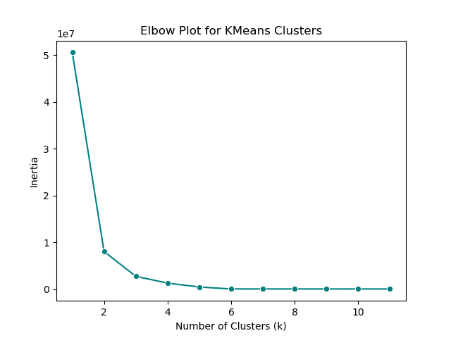

# KMeans Clustering of Land Cover in Yellowstone National Park

 By <a href="//commons.wikimedia.org/wiki/User:Carsten_Steger" title="User:Carsten Steger">Carsten Steger</a> - Own work, <a href="https://creativecommons.org/licenses/by-sa/4.0" title="Creative Commons Attribution-Share Alike 4.0">CC BY-SA 4.0</a>, <a href="https://commons.wikimedia.org/w/index.php?curid=126001255">Link</a>

## Introduction

Yellowstone National Park, located in Wyoming, Montana, and Idaho, is an ecologically rich and diverse landscape. Ecosystems in the park include coniferous forests(lodgepole pine, whitebark pine, Englemann spruce, and subalpine fir), subalpine meadows, sagebrush steppes, hydrothermal areas, and alpine tundra areas ([Kokaly et al. 2003](https://doi.org/10.1016/S0034-4257(02)00133-5), [National Park Service, 2025](https://www.nps.gov/yell/learn/upload/6_RI_2025_Vegetation_web.pdf)). For this project, I utilized a KMeans clustering algorithm to classify different land cover types within the park, using remote sensed spectral imagery from the [Harmonized Landsat](add link) dataset.

<embed type="text/html" src="./projects/KMeans_Clustering/yellowstone_site_plot.html" width="600" height="500">
The map above shows the park boundary.

KMeans clustering is an unsupervised machine learning algorithm that sorts data into any number of clusters. Basically, the algorithm selects a predetermined number of centroids in the dataset, and compares the Euclidean distance of each point to each centroid. Points are sorted by the lowest distance, and then the algorithm repeats using a new centroid within each group to cyclicly improve the clustering. The number of clusters is selected before running the algorithm; this number is typically based upon the number of groups expected to be found in the dataset, though there is also a balancing act between an adequate number of clusters and computer or model performance. There are some analytical techniques that can help identify the ideal number of clusters, which I performed to aid the analysis. This analysis is considered 'unsupervised', as I do not have "groundtruthed" data with which to contextualize or understand the clusters that the algorithm produces. As such, the KMeans algorithm will cluster the dataset, but I don't have a way to understand what each cluster is or truly evaluate how well the algorithm performed.

## Methods

In this notebook, I used KMeans clustering to classify land cover in Yellowstone National Park, using spectral imagery from the Harmonized Landsat (HLS) dataset. First, I downloaded the boundary shapefile for all of the National Parks in the US, which is stored on [the NPS website](https://irma.nps.gov/DataStore/Reference/Profile/2224545?lnv=True), and extracted just the boundary for Yellowstone. Next, I used that boundary to locate the url to each satellite image (also known as a granule) from the HLS dataset that is included in the boundary. After compiling a list of the links, I extracted all of the important metadata for each granule. Using a VSI connection to HLS, I then utilized the quality control labels [provided by the HLS user guide](https://lpdaac.usgs.gov/documents/1698/HLS_User_Guide_V2.pdf) to apply a cloud mask to remove cloudy pixels, after which I found the median pixel value for each pixel across the temporal range. Once I performed these data wrangling steps, I created a file that composited all of the granules. Finally, I conducted KMeans clustering using the composite file to identify land cover groups within Yellowstone National Park.

## Results and Discussion

<embed type="text/html" src="./projects/KMeans_Clustering/rgb_kmeans_plot.html" height="500" width="800">
The plot above shows a comparison between the RBG spectral imagery and the KMeans clusters. 

Click [here](./projects/KMeans_Clustering/rgb_kmeans_plot.html) to view a larger version.

Qualitatively, the KMeans clustering seems to capture the different land cover types in Yellowstone well. It clearly clustered bodies of water and open lands such as steppes, alpine areas, and subalpine meadows. In addition, the KMeans clustering reveals differences in forest type that aren't easily distinguishable from the RBG plot. However, based upon my personal knowledge of Yellowstone, it appears that the KMeans algorithm clustered the sagebrush steppe and alpine areas together, which is a false grouping, as those ecosystems are of course distinct. Given that both are sparsely vegetated, it makes sense that the clustering algorithm is unable to separate the two. Interestingly, the clusters also reveal areas that do not fall into the groups, shown in white, which doesn't fall into the colorbar scale. Given that the spectral imagery used for the clustering is the median pixel value for a roughly six-week period, this group is likely comprised of areas that are consistently cloudy. This finding could be indicating geyser basins that are constantly releasing steam, which the HLS quality control labels as clouds. When compared to a vegetation map in the National Park Service Vegetation brochure from 2025, the KMeans clustering shows roughly the same classifications shown in the vegetation map, further confirming the performance of the clustering.

Elbow plot showing cluster inertia relative to number of clusters.

Using an elbow plot, I was able to determine that the ideal number of clusters was 6, matching the number of dominant land cover types. The elbow plot shows that inertia greatly drops after just 2 clusters, and seems to completely flatten after 6. Given the number of land cover types, 6 is shown to be an excellent choice for the number of clusters. 

## Conclusion

In this analysis, KMeans clustering was shown to be effective at classifying land cover in Yellowstone National Park. Comparison to vegetation maps from the NPS shows good performance by the clustering algorithm, and an elbow plot showed that clustering performance was ideal at 6 clusters, which matches the number of large land cover classes. However, the clustering struggled to differentiate between relatively low-lying areas of sagebrush steppe and alpine tundra. It is likely more specific spectral data would be necessary to allow the KMeans to differentiate the two. Finally, it was interesting to see the HLS quality control likely pick out geyser basins in the park, labeled as clouds.

## Works Cited

You can view the notebook I used to complete this analysis [here](./projects/KMeans_Clustering/yellowstone_clustering.html).

Masek, J., Ju, J., Roger, J.-C., Skakun, S., Vermote, E., Claverie, M., Dungan, J., Yin, Z., Freitag, B., &amp; Justice, C. (2021). <i>HLS Operational Land Imager Surface Reflectance and TOA Brightness Daily Global 30m v2.0</i> [Data set]. NASA Land Processes Distributed Active Archive Center. [https://doi.org/10.5067/HLS/HLSL30.002] Date Accessed: 2026-02-18
Kokaly, R. F., Despain, D. G., Clark, R. N., & Livo, K. E. (2003). Mapping vegetation in Yellowstone National Park using spectral feature analysis of AVIRIS data. Remote Sensing of Environment, 84(3), 437–456. [https://doi.org/10.1016/S0034-4257(02)00133-5]
NPS - Land Resources Division. 2026. Administrative Boundaries of National Park System Units - National Geospatial Data Asset (NGDA) NPS National Parks Dataset. NPS - Land Resources Division. United States and Territories
[https://irma.nps.gov/DataStore/Reference/Profile/2316744]
National Park Service. (2025). Yellowstone resources & issues handbook: 2025. Yellowstone National Park, WY: U.S. Department of the Interior. [https://www.nps.gov/yell/learn/upload/6_RI_2025_Vegetation_web.pdf]
